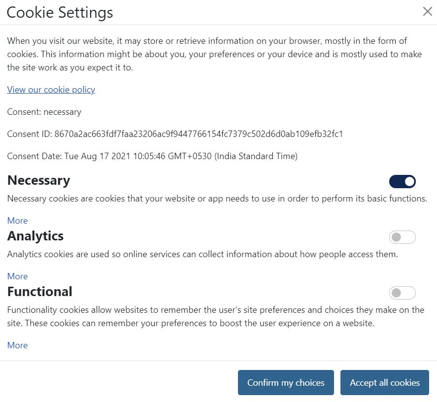

## GSoC 2021 Cookie Manager Work Report
**Project Repository:** https://github.com/joomla-projects/gsoc21_cookie-manager
 
**Pull Request:** https://github.com/joomla-projects/gsoc21_cookie-manager/pull/8
 
**Weekly Reports:** https://volunteers.joomla.org/teams/gsoc-21-feature-enhancement-2#reports
 
**Blog Posts:** [Blog 1](https://community.joomla.org/gsoc-2021/gsoc-project-cookie-manager.html)
 
**Joomla CMS Repository:** https://github.com/joomla/joomla-cms

### Overview
We have build a cookie manager to manage the browser cookies using a component and a plugin, where we can add scripts and cookies according to their category.
 
All the cookies will get blocked on the user's first visit and only activated after the user gave consent.

### Admin Part
#### Add Cookies
Here, website administrator can add cookies according to their categories to display it to the users.

#### Add Categories
Here, website administrator can add categories to categorize the cookies and scripts.

#### Add Scripts
Here, website administrator can add cookie setting scripts to block/unblock according to the user's consent.

#### View Consents
Here, website administrator can view the consents given by the users.

#### Change Configuration
Here, website administrator can change the component configuration.

### Site Part
#### Cookie Consent Banner
This is the banner which is displayed to the users on their first visit.

#### Cookie Settings Banner
This is the banner which is displayed to the users when they click on `More details` button.

